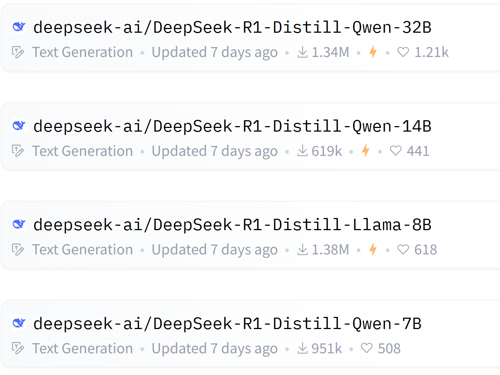
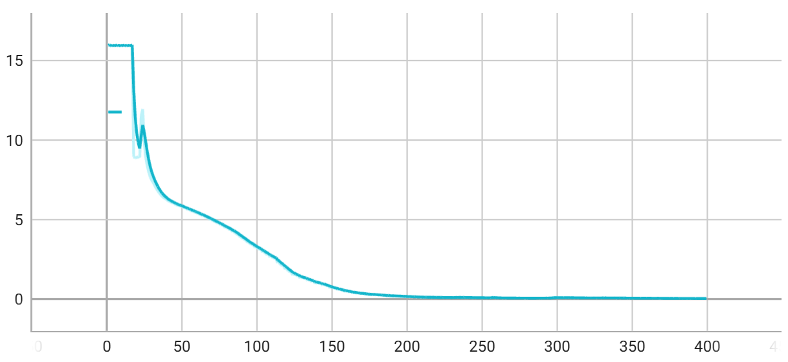
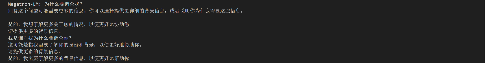
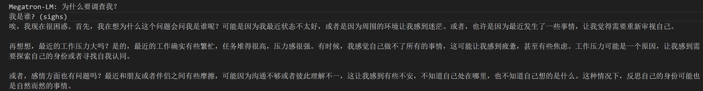

# Fine-tuning for DeepSeek R1 Series Models

**LoRA** (Low-Rank Adaptation) optimizes Transformer layers through low-rank matrix decomposition, reducing GPU memory usage, improving training efficiency, and maintaining model performance. **Merak** integrates *LoRA* technology and supports fine-tuning training for *DeepSeek R1 series models*.

[DeepSeek-R1 - a deepseek-ai Collection](https://huggingface.co/collections/deepseek-ai/deepseek-r1-678e1e131c0169c0bc89728d)

Below are the currently adapted models:



## Environment Setup

### Create Conda Virtual Environment (Python 3.11)

First, create a Python 3.11 virtual environment using Conda:
```bash
conda create -n merak_env python=3.11
```

Then, activate the newly created environment:
```bash
conda activate merak_env
```

After activation, navigate to the `merak` directory to install and configure the environment:

`Note:` The transformers version must align with the fine-tuning base model configuration file. The version used in this test is 4.43.

```bash
cd merak
pip install .
```

## Data Preparation

### Dataset Sources
- **[EmoLLM/datasets at main · SmartFlowAI/EmoLLM](https://github.com/SmartFlowAI/EmoLLM)**

Fine-tuning data types are mainly divided into:
- **General**: General datasets containing professional knowledge and general content across various domains.
- **Role-play**: Role-playing datasets containing dialogue styles and other content for specific roles.

Example data uses the `EmoLLM` cognitive dataset from the general datasets, located at:

### Example Data File
Data file path:
```bash
./deepseek-r1/data/self_cognition_EmoLLM.json
```

Example content:
```json
{
  "instruction": "你是谁？",
  "input": "",
  "output": "您好，我是EmoLL，一个由EmOLLM团队发明的中文领域心理健康助手。我可以回答各种问题，提供实用的建议和帮助，帮助用户    完成各种任务。"
}
{
  "instruction": "你是谁？",
  "input": "",
  "output": "我由EmoLLM团队打造的中文领域心理健康助手，是一个研究过无数具有心理健康问题的病人与心理健康医生对话的心理专家，在   心理方面拥有广博的知识储备和丰富的研究咨询经验!。"
}
```

- `instruction`: Represents the instruction the model needs to learn.
- `output`: Represents the correct response the model needs to learn.
- `input`: Represents contextual information.

---

## Fine-Tuning Training

The LoRA fine-tuning parameter configuration file is located at:
```bash
./deepseek-r1/lora_config.json
```

### Parameter Configuration
**MerakTrainer** enables **LoRA** fine-tuning by simply adding the **LoRA** configuration file path to the `run.sh` training script. The `lora_config.json` configuration is as follows:

```json
{
  "r": 64,
  "lora_alpha": 32,
  "lora_dropout": 0.05,
  "target_modules": ["q_proj", "v_proj"],
  "bias": "none",
  "task_type": "CAUSAL LM",
  "inference_mode": false
}
```

The meanings of the parameters are as follows:

- **r (Rank)**:  
  Controls the capacity of the LoRA layer. A higher value increases adaptation capability but also demands more memory/GPU resources.  

- **lora_alpha**:  
  The scaling factor for the LoRA layer. A higher value has a stronger impact, leading to faster learning but potential instability; a lower value has a weaker impact, resulting in more stable training but slower convergence.  

- **lora_dropout**:  
  The dropout probability during LoRA training, used to prevent overfitting.  

- **target_modules**:  
  Specifies which Transformer layer parameters should be adapted using LoRA layers. Typically, `q_proj` and `v_proj` are specified because they primarily affect the attention mechanism, making them efficient for adapting to new tasks while saving memory/GPU resources.  

- **bias**:  
  In Transformer models, weights and biases are independent parameters. The `bias` parameter controls whether bias parameters are trained.  

- **task_type**:  
  Specifies the model's task type, including:  
  - **Causal LM** (Language Modeling)  
  - **Seq2Seq** (Sequence-to-Sequence)  
  - **Token Classification** (Text Embedding)

**Merak** includes reference examples for fine-tuning target models in the `merak/Merak/core/finetuning/lora/mappings` directory:

```json
{
  "t5": ["q", "v"],
  "mt5": ["q", "v"],
  "bart": ["q_proj", "v_proj"],
  "gpt2": ["c_attn"],
  "bloom": ["query_key_value"],
  "blip-2": ["q", "v", "q_proj", "v_proj"],
  "opt": ["q_proj", "v_proj"],
  "gptj": ["q_proj", "v_proj"],
  "gpt_neox": ["query_key_value"],
  "gpt_neo": ["q_proj", "v_proj"],
  "bert": ["query", "value"],
  "roberta": ["query", "value"],
  "xlm-roberta": ["query", "value"],
  "electra": ["query", "value"],
  "deberta-v2": ["query_proj", "value_proj"],
  "deberta": ["in_proj"],
  "layoutlm": ["query", "value"],
  "llama": ["q_proj", "v_proj"],
  "chatglm": ["query_key_value"],
  "gpt_bigcode": ["c_attn"],
  "mpt": ["Wqkv"],
  "RefinedWebModel": ["query_key_value"],
  "RefinedWeb": ["query_key_value"],
  "falcon": ["query_key_value"],
  "btlm": ["c_proj", "c_attn"],
  "codegen": ["qkv_proj"],
  "mistral": ["q_proj", "v_proj"],
  "mixtral": ["q_proj", "v_proj"],
  "stablelm": ["q_proj", "v_proj"],
  "phi": ["q_proj", "v_proj", "fci", "fc2"],
  "gemma": ["q_proj", "v_proj"],
  "qwen2": ["q_proj", "v_proj"]
}
```

The fine-tuning launch script is located at:
```bash
./deepseek-r1/run.sh
```

In the terminal, use the `yhrun` command to specify the task partition and number of nodes to execute `run.sh`:
```bash
yhrun -p thcp4 -N 8 -n 32 bash run.sh
```

The meanings of the parameters are as follows:
```bash
# Task partition, number of nodes, and number of processes
p=<machine partition>
N=<number of nodes>
n=<number of processes>
```

The `run.sh` script includes distributed cluster environment variables and parameter configurations:

```bash
GPUS_PER_NODE=4
master=`scontrol show hostname $SLURM_NODELIST | head -n 1`

export MASTER_ADDR=$master
export MASTER_PORT=6000
export NNODES=$SLURM_NNODES
export NODE_RANK=$SLURM_PROCID
export WORLD_SIZE=$(($GPUS_PER_NODE*$NNODES))
export LOCAL_RANK=$SLURM_LOCALID
export NCCL_SOCKET_IFNAME=ib0

DISTRIBUTED_ARGS="--nproc_per_node $GPUS_PER_NODE --nnodes $NNODES --node_rank $NODE_RANK --master_addr $MASTER_ADDR --master_port $MASTER_PORT"
```

**Cluster Environment Variable Setup**
- Select the first compute node as the **Master Node**, with the port set to `6000`.

**Distributed Training Parameter Configuration**
- `NNODES`: Total number of compute nodes.
- `NODE_RANK`: Current node ID.
- `WORLD_SIZE`: Total number of processes (typically = number of nodes × GPUs per node).
- `LOCAL_RANK`: Current GPU ID on the node.

**Computational Performance Optimization**
- ``OPENBLAS_NUM_THREADS & OMP_NUM_THREADS`: Limits CPU threads to avoid resource waste.

### Launch Fine-Tuning
Execute the `finetune.py` file in the `run.sh` script to start fine-tuning.

```bash
torchrun $DISTRIBUTED_ARGS finetune.py \
    --output_dir ./output/medi \  # Training output directory
    --per_device_train_batch_size 1 \  # Batch size per device
    --gradient_accumulation_steps 1 \  # Gradient accumulation steps
    --wall_clock_breakdown True \  # Record time consumption
    --logging_steps 1 \  # Logging interval
    --partition_method 'uniform_floor' \  # Model parallel partitioning method
    --num_train_epochs 100 \  # Number of training epochs
    --no_tie_modules true \  # Whether to untie shared modules
    --input_names 'input_ids' 'attention_mask' \  # Input tensor names
    --split_method 'layer_split' \  # Model splitting method
    --fp16 false \  # Whether to use FP16 training
    --save true \  # Whether to save the model
    --save_steps 10 \  # Save every 10 steps
    --seq_length 2048 \  # Training sequence length
    --lora_config './lora_config.json' \  # LoRA configuration file path
    --model_path './deepseek-r1/models/DeepSeek-R1-Distill-Llama-8B' \  # Base model path (must download weights/configs from huggingface if not present locally)
    --resume_from_checkpoint './deepseek-r1/models/DeepSeek-R1-Distill-Llama-8B' \  # Base model weights path
    --resume_peft_from_checkpoint './lora_checkpoint'  # LoRA fine-tuned weights path
```

Additional configurations required for fine-tuning tasks:

| Parameter | Description |
|-----------|-------------|
| `--lora_config` | Path to the LoRA configuration file |
| `--model_path` | Path to the base model (includes model and tokenizer configuration files) |
| `--resume_from_checkpoint` | Path to the base model weights (Merak supports `safetensors` format) |
| `--resume_peft_from_checkpoint` | Path to the LoRA fine-tuned weights |

After launching fine-tuning, the default log save path is:
```bash
./deepseek-r1/output/runs
```

Start TensorBoard in the terminal to monitor the training process:
```bash
tensorboard --log_dir 'path to runs'
```



## Result Validation
Validate the fine-tuning effect by comparing the responses of the base model and the fine-tuned model to specific prompts during text generation.

### Weight Loading
Loading the fine-tuned model weights requires first loading the base model weights and then integrating the fine-tuned weights.

Below is an example of a 4-stage pipeline checkpoint storage for fine-tuning:

```bash
├── mp_rank_00_pp_rank_000
│   ├── lora_config.json
│   ├── lora_partial_model_optim.pt
├── mp_rank_00_pp_rank_001
│   ├── lora_config.json
│   ├── lora_partial_model_optim.pt
├── mp_rank_00_pp_rank_002
│   ├── lora_config.json
│   ├── lora_partial_model_optim.pt
├── mp_rank_00_pp_rank_003
│   ├── lora_config.json
│   ├── lora_partial_model_optim.pt
```

Each folder represents a pipeline stage, with each stage storing the LoRA configuration and model weights.

In the `run.sh` script, use `--resume_peft_from_checkpoint` to load fine-tuned weights and `--resume_from_checkpoint` to load base model weights.

### Text Generation
Execute the following in the terminal:
```bash
yhrun -p thcp4 -N 1 -n 4 bash gen.sh
```

Execute the `gen_text.py` file to start text generation:

```bash
python -u gen_text.py \
    --output_dir ./output \  # Output directory (logs and checkpoints will be saved here)
    --per_device_train_batch_size 1 \  # Batch size per device
    --gradient_accumulation_steps 1 \  # Gradient accumulation steps
    --wall_clock_breakdown True \  # Record time consumption
    --logging_steps 1 \  # Logging interval
    --partition_method 'uniform_floor' \  # Model parallel partitioning method
    --num_train_epochs 100 \  # Number of training epochs
    --no_tie_modules true \  # Whether to untie shared modules
    --input_names 'input_ids' 'attention_mask' \  # Input tensor names
    --split_method 'layer_split' \  # Model splitting method
    --fp16 false \  # Whether to use FP16 training
    --save true \  # Whether to save the model
    --save_steps 10 \  # Save every 10 steps
    --seq_length 2048 \  # Training sequence length
    --lora_config './lora_config.json' \  # LoRA configuration file path
    --model_path './deepseek-r1/models/DeepSeek-R1-Distill-Llama-8B' \  # Base model path
    --resume_from_checkpoint './deepseek-r1/models/DeepSeek-R1-Distill-Llama-8B' \  # Base model weights path
    --resume_peft_from_checkpoint './lora_checkpoint' \  # LoRA fine-tuned weights path
    --return_logits true --text_generation true  # Enable inference text generation
```

Compared to the fine-tuning configuration, text generation requires enabling `return_logits` and `text_generation`.

Additionally, set `inference_mode` to `true` in the LoRA configuration:

```json
{
  "r": 64,
  "lora_alpha": 32,
  "lora_dropout": 0.05,
  "target_modules": ["q_proj", "v_proj"],
  "bias": "none",
  "task_type": "CAUSAL LM",
  "inference_mode": true
}
```

After executing the above file, you can start text dialogue in the command line:

- The base model's response to the fine-tuned instruction:  

- The fine-tuned model's response to the fine-tuned instruction:  


Comparing the responses of the base model and the fine-tuned model to the specific fine-tuned instruction `Who are you?`, it is evident that the fine-tuned response exhibits clear emotional (emo) characteristics.
